# 在 macOS 上开发 STM32（HAL 库、CLion）

创建于 2025/11/07；编辑于 2025/12/06

---

本文记录一下使用 macOS 使用 CLion、HAL 库开发 STM32 点亮 LED 灯的最简单方法

## 环境配置

### 安装 CLion

CLion 是 JetBrains 的一款集成式 C、C++ 开发环境，可以用于开发 STM32，且集成度不错，自动补全很好用。

直接去 [官网](https://www.jetbrains.com/clion/) 下载一个就可以了，根据自己的芯片来。

截止目前，CLion 已对非商业使用免费，安装完成后默认是 30 天的试用期，点击左下角的 Trail，再点击 Free for Learning and Hobby，登陆账户就可以激活使用了。

### 安装 Java

使用 HAL 库开发 STM32，STM32CubeMX 基本属于必备。其基于 Java 运行，需要安装一个 Java。

仍然是前往 [官网](https://www.oracle.com/java/technologies/javase-downloads.html) 下载：dmg 格式，选择体系架构，下载好后直接打开安装。

之后可以在终端 `java --version` 检查安装是否成功。

### 安装 STM32CubeMX 和 STM32CubeCLT

在 CLion 中新建嵌入式项目 - STM32CubeMX，至少需要安装 STM32CubeMX 和 STM32CubeCLT

下载地址：[STM32CubeMX](https://www.st.com/en/development-tools/stm32cubemx.html)、[STM32CubeCLT](https://www.st.com/en/development-tools/stm32cubeclt.html)

> STM32CubeMX 是 x86_64 应用，需要安装 rosetta2 才能运行，如果之前没有装过 rosetta2，可以执行 `softwareupdate --install-rosetta` 安装它。

下载好后解压，直接安装 `SetupSTM32CubeMX-x.xx.x` 和 `st-stm32cubeclt_x.xx.x_xxxxx_xxxxxxxx_xxxx-macosx_x86_64.pkg`。目前无需查看包内容再安装，双击打开就可以。

安装完成后可以进入 CLion，按下 `Command + ,` 打开设置 - Build, Execution, Depolyment - Embedded Development，右侧窗口应当可以自动检测出 STM32CubeMX 和 STM32CubeCLI 的位置，点击 Test 可以验证其可用性。

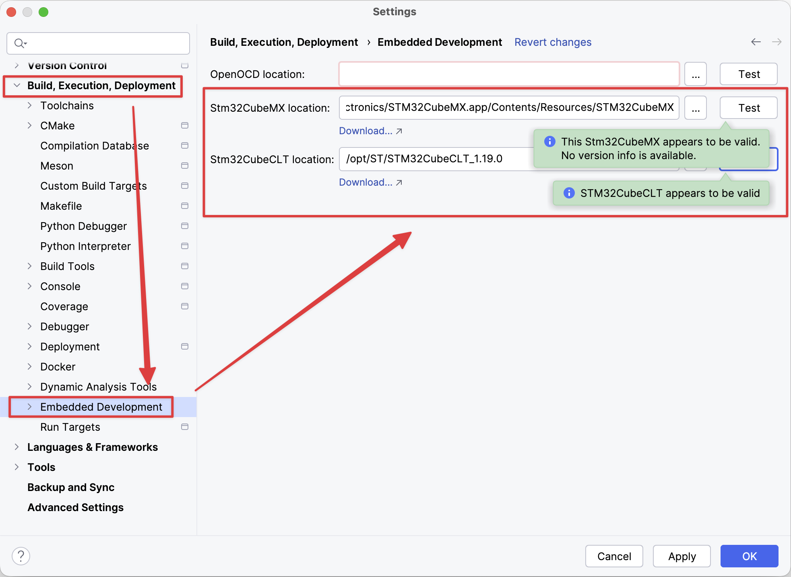

## 创建项目

在 CLion 里面创建项目，左侧选择嵌入式开发 - STM32CubeMX，右侧确保 STM32CubeMX 和 STM32CubeCLT 都存在，并启动 STM32CubeMX。

它真的只是给你打开了 STM32CubeMX 而已，你需要在其中手动创建项目，具体操作细节该窗口中就已经讲的很明白了。

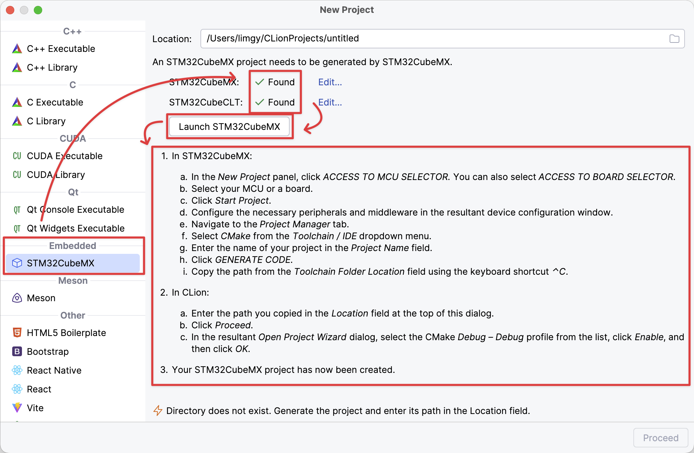

## 编译和烧录

在编译之前确认 CMake Profiles 选择的是 Debug - Debug，点击右边小锤子编译，信息窗口就能看到编译完成的提示了。

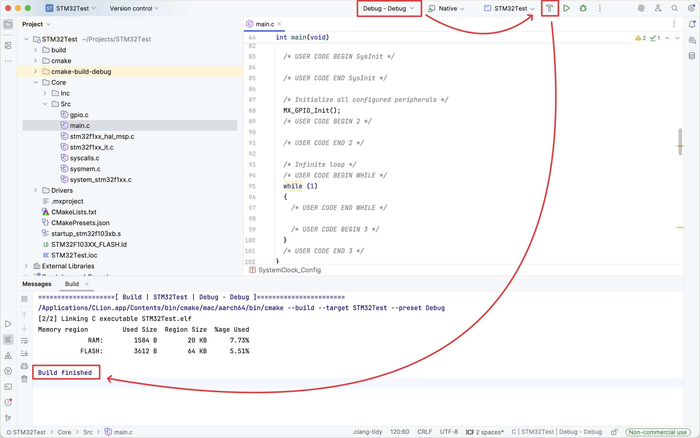

### 使用 J-Link Driver 烧录

使用 J-Link 调试器是笔者认为最简单的调试方法，J-Link 就用淘宝十几块钱兼容 SWD 的那种（类似下图）就可以。

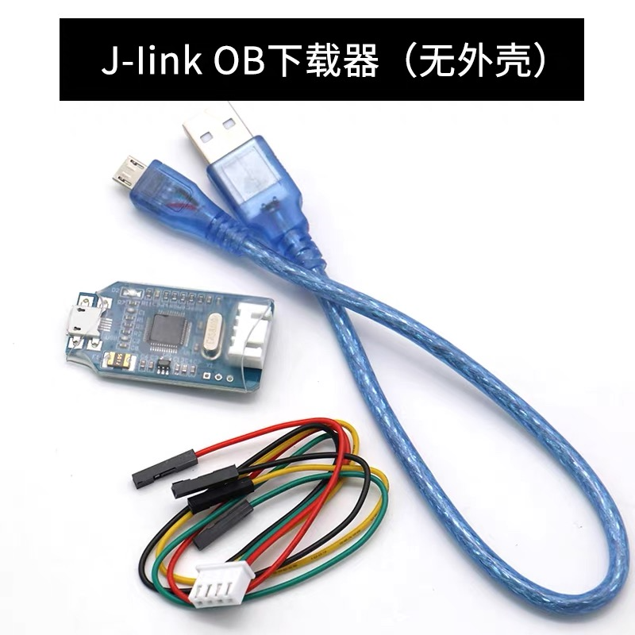

去 [这里](https://www.segger.com/downloads/jlink/) 下载 J-Link 的驱动，pkg 格式直接安装，安装完成或许需要重启 CLion 或者计算机，

在 CLion 中，需要为 J-Link 调试器添加一个 Debug Server：

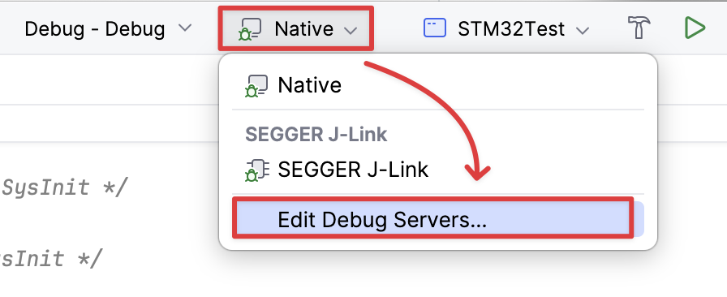

点击 Add New，选择 SEGGER J-Link。

Executable 可执行文件应当能自动被 CLion 识别到，此处无需修改；Device 需要选择开发的单片机型号，此处选择 STM32F103C8。

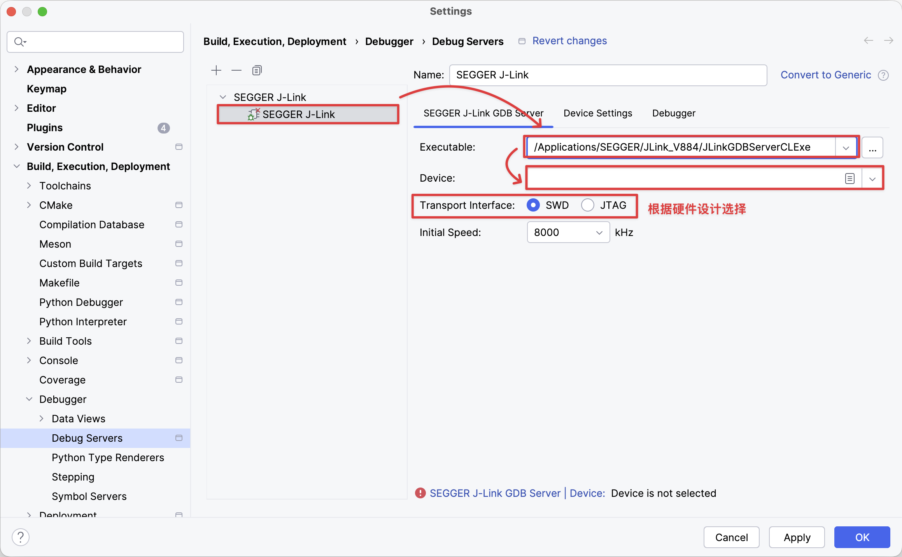

选择刚刚新建的 Debug Server，之后点击运行，即可将程序烧录到单片机上了，信息窗口可以看到烧录成功的提示：

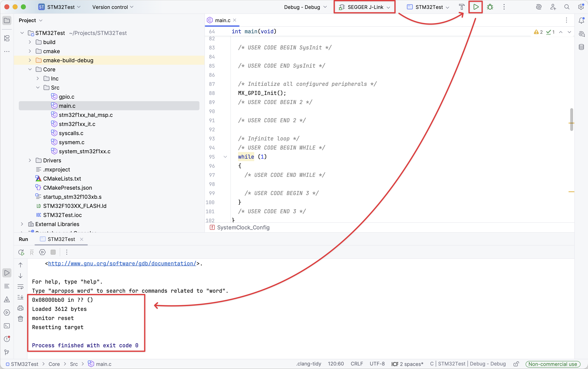

### 使用 OpenOCD 烧录

OpenOCD 可以前往 [此处](https://github.com/xpack-dev-tools/openocd-xpack/releases) 下载，对于 M 芯片的 Mac 而言，下载 darwin arm64 的版本即可。

下载好后直接解压，重命名成 openocd 直接丢进 `/opt/` 里面，之后在 CLion 里面设置 OpenOCD 的路径，并验证（方法前文讲过了）。

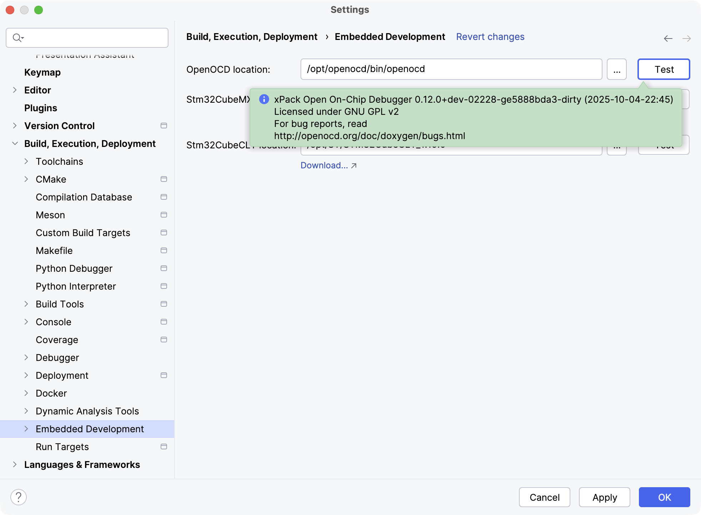

针对 OpenOCD 而言，添加的不是 Debug Server，而是 Run/Debug Configurations，如下图所示：

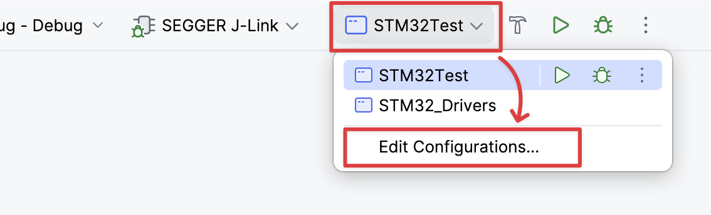

点击左上角的 +，添加一个 OpenOCD Download & Run

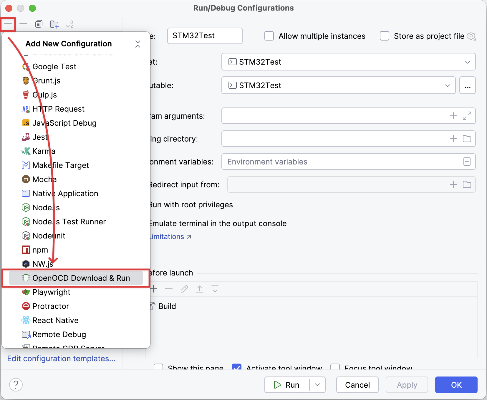

右侧如图所示配置

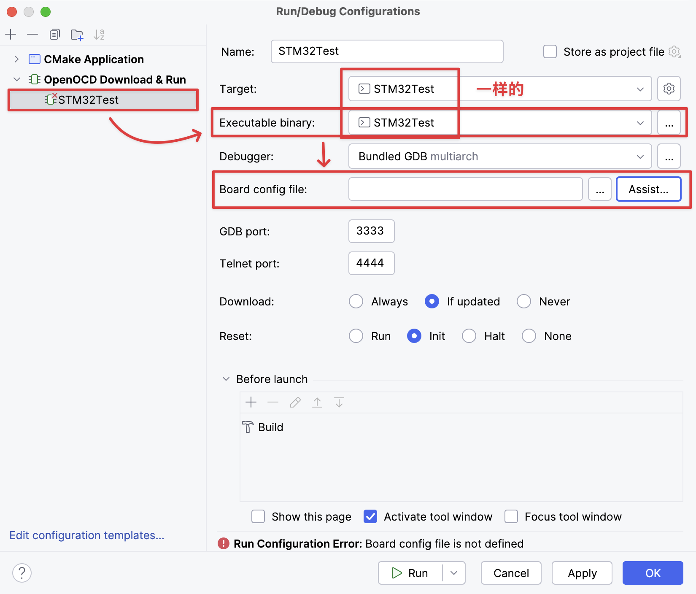

Board config file 需要自己编写一个：OpenOCD 自带了一些 target 和调试器的配置文件，分别在安装目录的如下位置：

- target：`openocd/scripts/target`
- 调试器：`openocd/scripts/interface`

自己编写的 Board config file 可以引用上述 target 和调试器的配置，再加上一点点自己写的配置就可以，如下是使用 CMSIS-DAP 调试器，swd 调试，设备为 STM32F1xx 系列单片机的配置文件。

```config
source [find interface/cmsis-dap.cfg]

transport select swd

source [find target/stm32f1x.cfg]
```

自己写好配置文件后，重新回到 CLion 对应窗口，填写 Board config file 的位置即可。

最后在 CLion 右上角，不要选择 SEEGER J-Link，而选择 Native，右侧选择刚创建的 OpenOCD Download & Run 项目的名称，也就是 STM32Test，再运行，即可成功烧录。

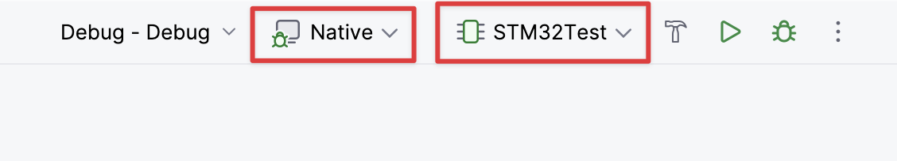

由于 CMSIS-DAP 调试器目前不在身边，就没有截图展示烧录成果了。