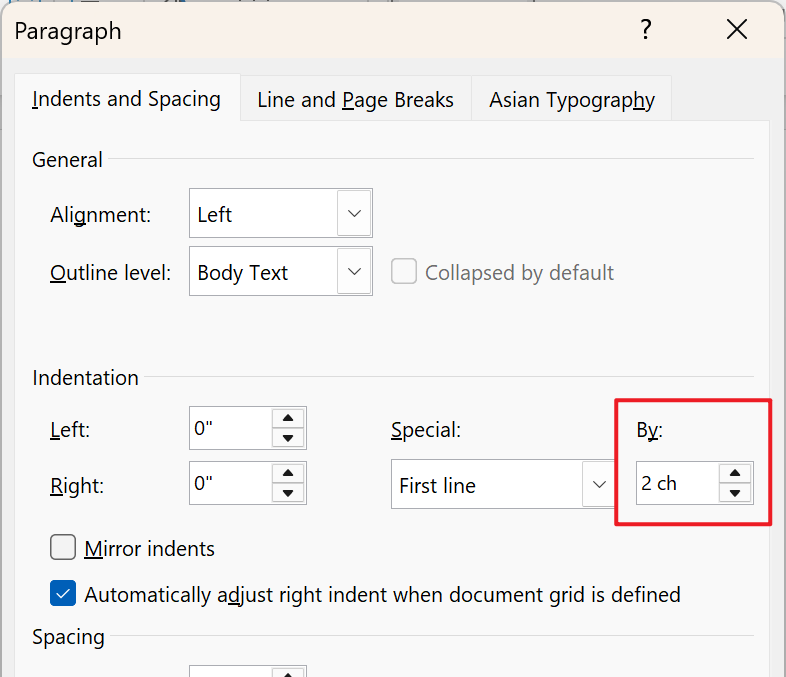

# 在英文版本的 Word 中首行缩进 2 个字符

创建于 2025/01/30；编辑于 2025/01/30

---

在中文版本的 Word 中，在段首按下 Tab 键会自动格式化成首行缩进 2 字符，而英文版本是缩进一定的距离。

想要在英文版本 Word 中首行缩进两字符，只需要打开「段落」设置，在 Indentation - Special 中选择 First Line，然后 By 设置成 2 ch 即可，如下图所示：

