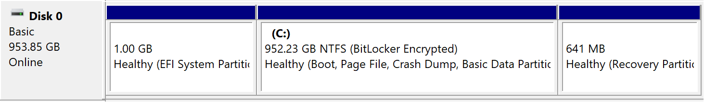

# 双系统删除 Linux

创建于 2025/05/13；编辑于 2025/05/13

---

注：仅适用于 GPT + UEFI 引导。

主要问题是如何处理 Windows 的恢复分区，当前磁盘分区如下：

```powershell
Partition ###  Type              Size     Offset
-------------  ----------------  -------  -------
Partition 1    System            1024 MB  1024 KB
Partition 2    Reserved            16 MB  1025 MB
Partition 3    Primary            475 GB  1041 MB
Partition 4    Recovery           642 MB   476 GB
Partition 5    Unknown            476 GB   476 GB
```

其中分区 5 为 Linux 所在分区，分区 4 为 Windows 的恢复分区，可见恢复分区位于 Linux 所在分区之前，删除 Linux 所在分区后，无法直接将空间分配给 Windows 所在分区（3）。

## 删除 Linux 操作系统

### 删除分区

首先可以直接干掉 Linux 的分区，在 Diskpart 实用工具中选择磁盘和分区，执行 `delete partition` 删除 Linux 所在分区。

### 删除启动项

第二步可以干掉多余的 UEFI 启动项，执行 `bcdedit /enum firmware` 查看当前 UEFI 启动项信息，比如下面这个：

```powershell
Firmware Application (101fffff)
-------------------------------
identifier              {1e2979a9-dc0a-11ef-963e-806e6f6e6963}
device                  partition=\Device\HarddiskVolume1
path                    \EFI\debian\shimx64.efi
description             debian
isolatedcontext         Yes
```

可以发现这是一个明显具有 Linux 特征的启动项，记录下它的 identifier，即 `{1e2979a9-dc0a-11ef-963e-806e6f6e6963}`

执行 `bcdedit /delete '{1e2979a9-dc0a-11ef-963e-806e6f6e6963}'` 删除它，注意需要包括单引号。

直到删除所有具有 Linux 特征的启动项即可。

## 移动 Windows 恢复分区

1. 首先需要禁用当前的恢复分区：`reagentc /disable`，这会将当前恢复分区中的 Winre.wim 移动到 `C:\Windows\System32\Recovery` 目录中。
2. 运行 Diskpart 实用程序，选中目前的恢复分区，执行 `delete partition override` 即可删除当前恢复分区。
3. 选中 Windows 所在分区，执行 `extend` 扩展该分区空间到整个磁盘；随后执行 `shrink desired=642` 在磁盘末尾留出 642 MB 的剩余空间。
4. 执行 `create partition primary` 在末尾的 642 MB 空间内创建新的主分区，随后执行 `format quick fs=ntfs` 进行格式化。
5. 
    打开磁盘管理实用程序，查看新建的分区是否被自动开启 BitLocker 加密，若加密，可以退出 Diskpart 后执行 `mountvol`，查看有无类似以下内容：

    ```
    \\?\Volume{80624315-844d-4e7c-aed9-9fb702deade1}\
    *** NO MOUNT POINTS ***
    ```

    > 若有多个类似分区，可以在磁盘管理程序的对应分区上右键，在安全选项卡中查看。

    执行 `manage-bde -off '\\?\Volume{80624315-844d-4e7c-aed9-9fb702deade1}\'`（注意单引号）解密该分区。

    至此，新建的分区应当被解除 BitLocker 加密。

6. 
    选中该新创建的分区，执行 `set id=de94bba4-06d1-4d40-a16a-bfd50179d6ac` 和 `gpt attributes=0x8000000000000001` 将其标记为 Recovery 分区。

    此时磁盘的分区应当如下：

    ```powershell
    Partition ###  Type              Size     Offset
    -------------  ----------------  -------  -------
    Partition 1    System            1024 MB  1024 KB
    Partition 2    Reserved            16 MB  1025 MB
    Partition 3    Primary            952 GB  1041 MB
    * Partition 4    Recovery           641 MB   953 GB
    ```

7. 重新启用恢复分区：退出 Diskpart 后，执行 `reagentc /enable`，这会重新将 Winre.wim 移动到刚才新建的恢复分区中。

## 测试

按下 Shift 点击重启按钮，成功进入 Winre 环境。

恢复 BIOS 到出厂设置，输入 BitLocker 解密密钥后成功进入系统，再次重启无需输入密钥。

与 Linux 相关的 UEFI 启动项已经全部删除。



创建的恢复分区比原有恢复分区小 1 MB，不影响正常使用。

至此，双系统删除 Linux 的操作全部完成。

---

参考：[Moving Windows Recovery Partition Correctly](https://thedxt.ca/2023/06/moving-windows-recovery-partition-correctly/)