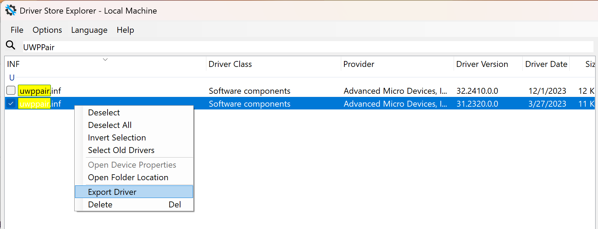

# 手动安装 UWP 版本 AMD Software

创建于 2025/05/18；编辑于 2025/05/18

---

使用 AMD 集成显卡的笔记本用户在重装微软原版（或称非 OEM 定制）系统后，如果选择让 Windows 自动接管显卡驱动程序的安装，或使用笔记本厂商官网提供的驱动程序，很可能会出现 AMD Software 没有被安装的情况。

部分情形下，Microsoft Store 会自动安装 AMD Software，但更多的情况是 AMD Software 将永远不会被自动安装，对使用造成了一定影响。

此外，当 AMD 集成显卡驱动程序被 Windows Update 自动更新后，会出现非常经典的「AMD Radeon Software 的版本与当前已安装的图形驱动程序不兼容」问题，这也是由于 AMD Software 没有被自动更新导致的，与上述问题可归为同类。

本文尝试通过手动安装 AMD Software 来解决上述问题。

## 原理

DCH (Declarative, Componentized & Hardware Support App (HSA)) 是微软从 Windows 10 以来开始推动的一种现代驱动架构规范，其中 HSA 可理解为与驱动配套的专属应用，此应用程序必须通过 Microsoft Store 分发和更新。这是为了减小驱动程序本体的体积，方便 Windows Update 自动更新驱动程序。

现代笔记本厂商在其官网提供的显卡驱动程序通常**遵循 DCH**，部分下载到的显卡驱动中不包含 HSA。由于 Microsoft Store 网络连接问题、加之系统下载 HSA 似乎并不积极，这也是造成 AMD Software 不知所踪的主要原因。

## 查询对应的 AMD Software 版本

### 如果你有驱动安装程序

可以使用任何软件，在安装程序目录中尝试搜索 `UWPPair` 字样，并找到 `UWPPair.inf` 文件，使用文本编辑器查看其内容。

### 如果你没有驱动安装程序

可以使用 [DriverStoreExplorer](https://github.com/lostindark/DriverStoreExplorer/releases) 软件，搜索 `UWPPair`，选择与当前版本驱动程序日期最接近的一个，右键导出驱动程序，获得 `uwppair.inf` 文件，同样使用文本编辑器查看其内容。



---

在 `UWPPair.inf` 中，查找 `[AMDRadeonsettingsSoftware]` 字段，内容如下：

```inf
[AMDRadeonsettingsSoftware]
SoftwareType=2
SoftwareID=pfn://AdvancedMicroDevicesInc-2.AMDRadeonSoftware_0a9344xs7nr4m
SoftwareVersion=10.23.20001.0
```

记录其中 SoftwareVersion 的值。

## 下载对应的 AMD Software (UWP)

打开 [Microsoft Store - Generation Project](https://store.rg-adguard.net/)，搜索 9NZ1BJQN6BHL，搜索类型为 ProductID。

搜索后会出现一系列结果，主要关注文件名为 `AdvancedMicroDevicesInc-2.AMDRadeonSoftware_xx.xx.xxxxx.x_x64__0a9344xs7nr4m.appx | .msix` 的文件，其中 `xx.xx.xxxxx.x` 与上一节查到的 SoftwareVersion 相匹配，如果没有完全一样的，请选择最相近的版本（一般都是其中 5 位数 xxxxx 的后两位不同）。

比如上一节的 SoftwareVersion 值为 10.23.20001.0，可以选择的版本是 10.23.20030.0.

## 安装

下载完成的 `*.appx | *.msix` 文件直接双击打开即可完成安装。

---

参考：[DCH Design Principles and Best Practices](https://learn.microsoft.com/en-us/windows-hardware/drivers/develop/dch-principles-best-practices)
