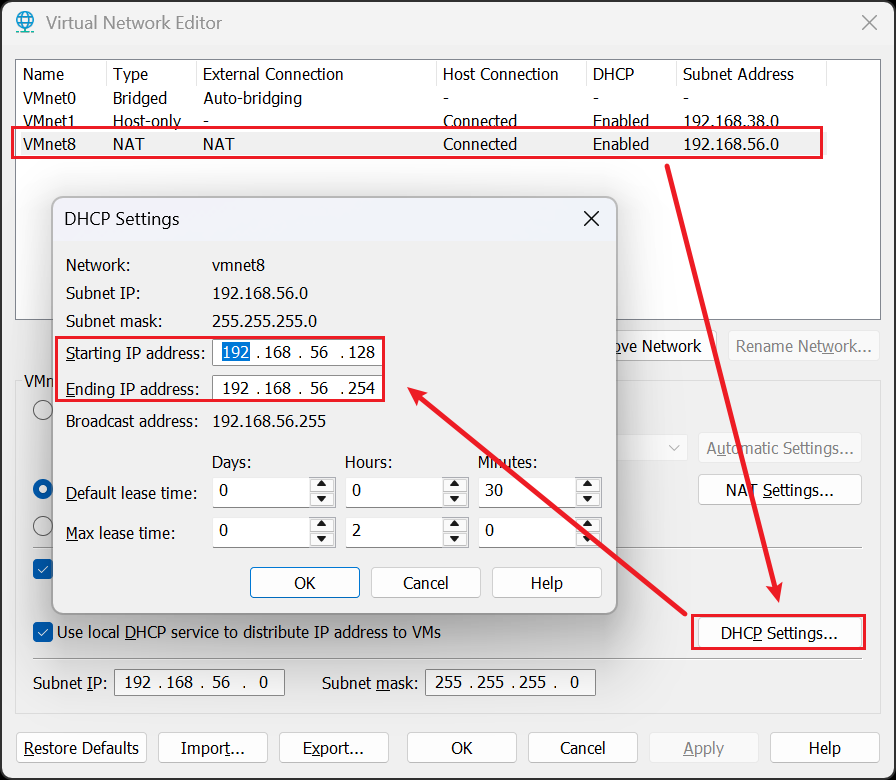
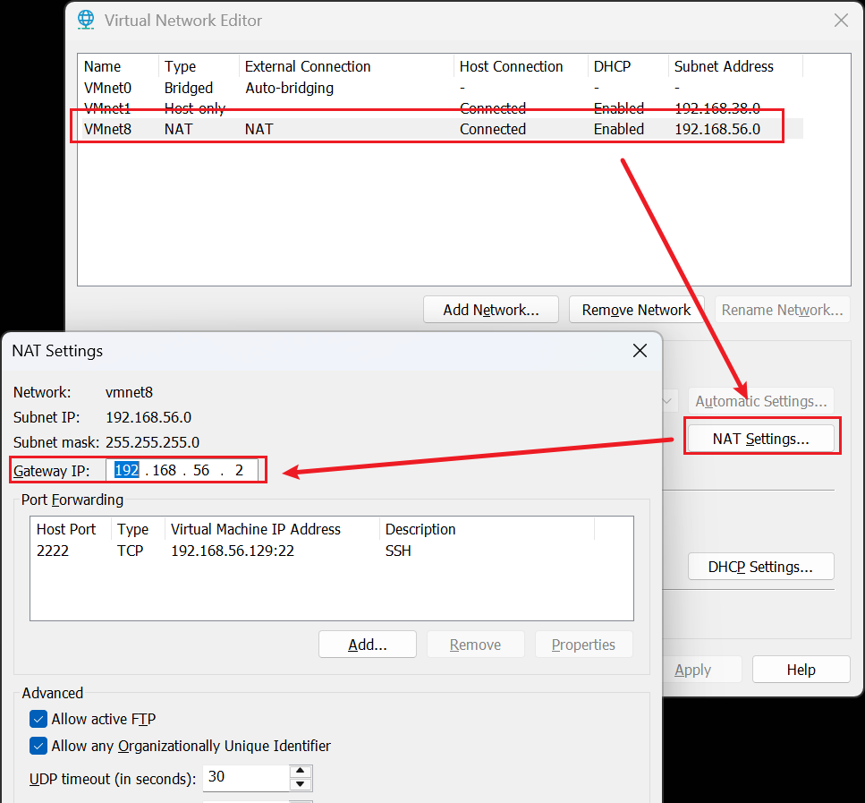
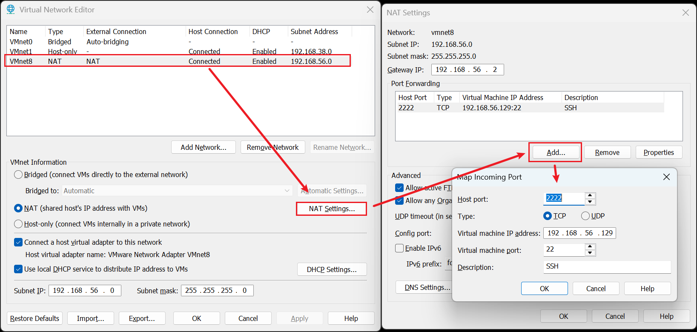
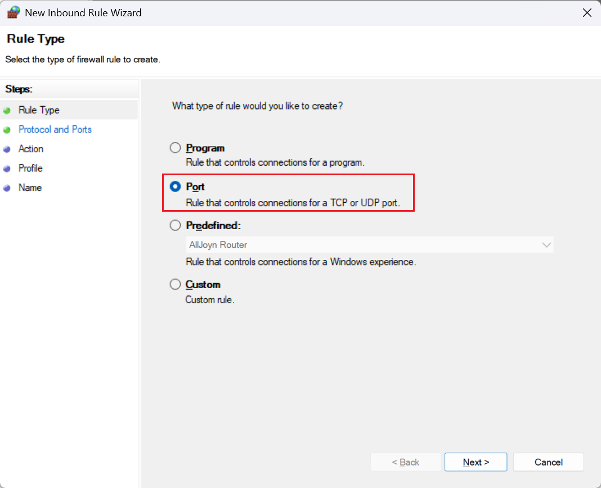
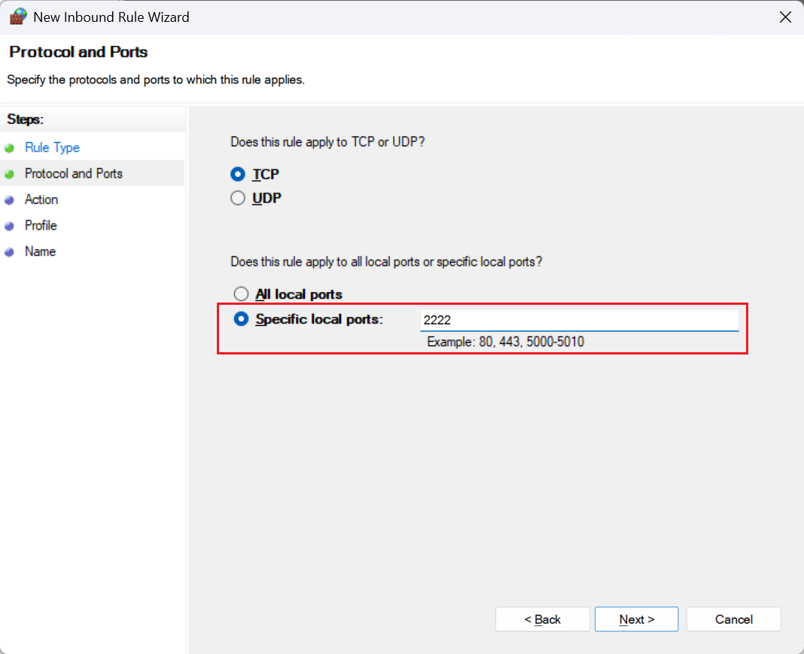
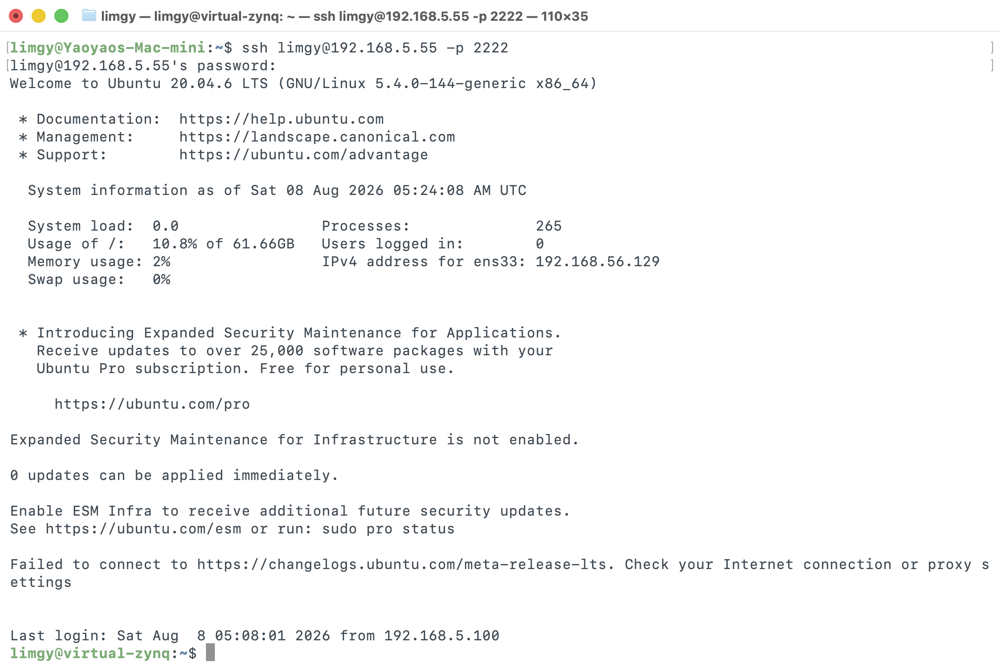

# 安装 Ubuntu Server，并使用 Vmware 的 NAT 网络配置端口转发，从局域网内其他电脑 ssh 访问

创建于 2026/08/08；编辑于 2026/08/08

---

属于踩坑记。

## 安装 Ubuntu Server 虚拟机

需要注意一个老生常谈的问题，由于网络环境不好，装系统的时候不要配置网络，在 Vmware 里把网卡删除掉。

## 配置虚拟机上网

装完系统后，将 NAT 网络打开，或许会发现 ubuntu 本身并没有网络，执行 `ip addr` 后发现 ens33 的状态为 DOWN。

为了启用网卡并固定一个 IP，可以编辑 `/etc/netplan/01-netcfg.yaml`：

```yaml
network:
  version: 2
  ethernets:
    ens33:
      addresses:
        - 192.168.56.129/24 # 打算分配给虚拟机的 IP，和掩码，需确保在 Vmware NAT DHCP 设置的可用 IP 范围内
      routes:
        - to: default
          via: 192.168.56.2 # Vmware NAT 网络设置中的网关
      nameservers:
        addresses:
          - 192.168.56.2 # DNS，需要设置为上面的网关，否则无法连接互联网
```

如下图查看 DHCP 分配情况：



如下图查看 NAT 的网关：



设置完成后重启 Ubuntu 虚拟机，再开机执行 `ip addr`，结果如下：

```shell
limgy@virtual-zynq:~$ ip addr
1: lo: <LOOPBACK,UP,LOWER_UP> mtu 65536 qdisc noqueue state UNKNOWN group default qlen 1000
    link/loopback 00:00:00:00:00:00 brd 00:00:00:00:00:00
    inet 127.0.0.1/8 scope host lo
       valid_lft forever preferred_lft forever
    inet6 ::1/128 scope host 
       valid_lft forever preferred_lft forever
2: ens33: <BROADCAST,MULTICAST,UP,LOWER_UP> mtu 1500 qdisc fq_codel state UP group default qlen 1000
    link/ether 00:0c:29:b7:6f:df brd ff:ff:ff:ff:ff:ff
    inet 192.168.56.129/24 brd 192.168.56.255 scope global ens33
       valid_lft forever preferred_lft forever
    inet6 fe80::20c:29ff:feb7:6fdf/64 scope link 
       valid_lft forever preferred_lft forever
```

可以发现已经成功分配了 IP，再测试联网状态 `ping www.gnu.org`，可以 ping 通。

## 配置 ssh

首先要确保虚拟机已经安装 ssh，并启动 ssh 服务，在安装 Ubuntu Server 的时候让选过：`systemctl status ssh`

为了让虚拟机 NAT 网络里的 22 端口（SSH 默认使用）可以被其他设备访问，需要做一个端口转发，如下图所示：



在 Mac Incoming Port 中如下设置：

- Host port：要映射到宿主机的哪个端口
- Type：ssh 需求选择 TCP 即可
- Virtual machine IP address：填写上面在虚拟机里配置的固定 IP
- Virtual machine port：要映射虚拟机里的哪个端口？ssh 默认 22 端口，此处填写 22

这时就可以尝试在本地宿主机访问了，打开 Windows Terminal，执行 `ssh <USERNAME>@localhost -p 2222` 即可访问虚拟机命令行。

## Windows 防火墙

此时使用其他设备访问宿主机 IP 是不可行的，也无法 ping 通，这是 Windows 防火墙导致的，搜索高级安全 Windows Defender 防火墙，添加一个入站规则：

类型选端口



端口填写刚才从 NAT 映射出来的 2222



后面都直接下一步即可，想理解可以去搜索 Windows 私有、公用网络的区别。

这样配置完成后，本地局域网的其他机器就可以访问 Windows 宿主机的 2222 端口，从而 ssh 进入虚拟机了：



## macOS?

如果使用 macOS 设备连接局域网 Wi-Fi 访问，可能会遇到卡顿问题，详见。