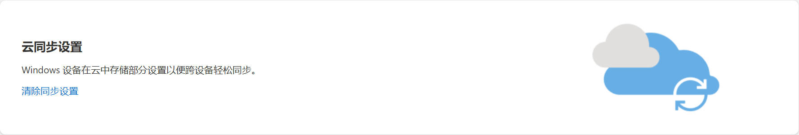

# Windows 语言变成「中文（新加坡）」

创建于 2021/05/16；编辑于 2024/04/15

---

安装完 Windows 10 并登陆微软账户后，有时会出现系统的语言自动会变成「中文（新加坡）」的问题，导致系统默认的时间格式和「中文（中华人民共和国）」的时间格式不同，看起来令人十分难受。

关键在于，本质上新加坡的中文也是中文，因此系统设置并不能直接从「中文（新加坡）」改成「中文（中华人民共和国）」，这看起来成为了一个死局。

不过事实上，还是有解决办法的。

## 本地解决方案

### 强制删除「中文（新加坡）」

使用管理员模式打开 Windows Powershell，输入命令： `Get-WinUserLanguageList`，观察所得信息中是否包含 `LanguageTag : zh-Hans-SG`

若存在如上内容，接下来仅需要依次（一次一行）输入并执行以下命令，即可删除「中文（新加坡）」：

```powershell
$LangList = Get-WinUserLanguageList
$MarkedLang = $LangList | where LanguageTag -eq "zh-Hans-SG"
$LangList.Remove($MarkedLang)
Set-WinUserLanguageList $LangList -Force
```

### 添加「中文（中华人民共和国）」

打开设置——时间和语言——语言——添加语言——搜索 Chinese，选择「中文（中华人民共和国）」即可。

## 清除云端故障

导致这种问题出现的原因，是微软的设置同步服务器出现了差错，将设备的语言自动同步为「中文（新加坡）」，因此只需要清除云端同步数据即可。

打开 [微软账户设备管理页面](https://account.microsoft.com/devices)，清除云同步设置：



## 其他

由于出现问题的原理是同步服务器出错，所以任何设置出错都不足为奇，比如鼠标左右键莫名对调等。

---
参考

[https://www.sysgeek.cn/windows-10-force-remove-language-pack](https://www.sysgeek.cn/windows-10-force-remove-language-pack)
