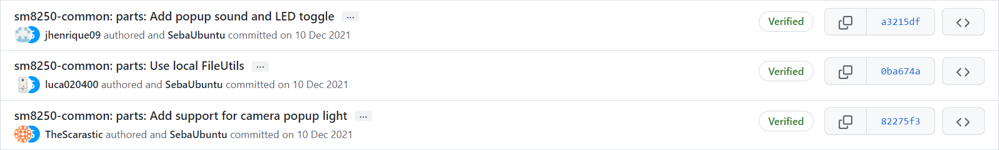
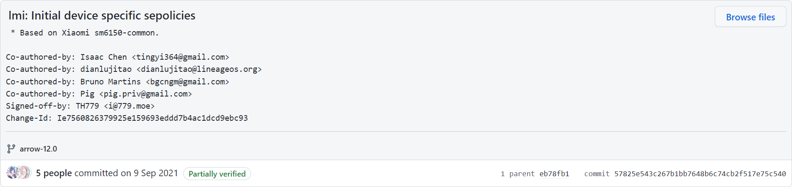
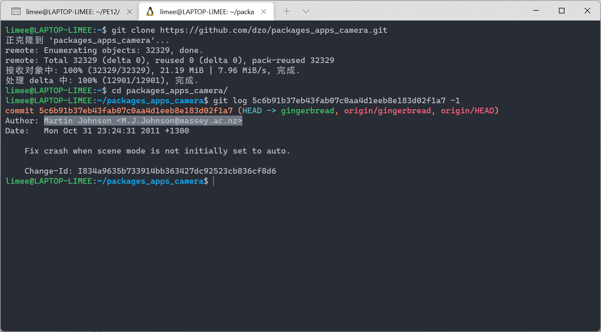

# Git commit 作者相关问题

创建于 2022/01/29；编辑于 2025/02/21

---

## 作者和提交者？

在 Github 上显示 **A** authored and **B** committed... 的，就是「作者」和「提交者」不同的情况。



想达到这样的效果，只需要在提交的时候使用 `git commit --author "user.name <user.email>"` 就可以了。

还记得使用 Git 时配置的这些信息吗？

```
git config --global user.name "在此处替换成你的名字"
git config --global user.email "在此处替换成你的邮箱"
```

上文的 `user.name` 和 `user.email` 指的就是作者使用 Git 时设置的这些信息。

## 具有多个作者的提交

在 Github 上还可以见到诸如 X people commited... 的具有多个作者的情况。


想要达到这样的效果，需要在提交信息的尾行 <strike>（其实也可以不是尾行，但应尽量靠后，不要写在前面）</strike> 加入 `Co-authored-by: user.name <user.email>`



## 获得作者的用户名和邮箱地址

### 直接在 Github 用户界面查看

比较简单，在提交页面点击作者的头像即可进入作者的 Github 界面，左侧即可看到相应的信息，摘取所需的部分即可。


> 比较粗大的是昵称，下面相对小一点的灰色字才是用户名。  
> 比如上图中 `Utsav Balar` 是昵称，`UtsavBalar1231` 才是用户名。

这种情况有一些局限性，比如作者不愿意在 Github 上公开自己的电子邮件信息的时候就比较难办 <strike>（也不是完全不行）</strike>，此时可以使用剩下的两种方法。

### 使用 cherry-pick 摘取提交

> 使用此方法，最好是在同一仓库的不同 fork 之间操作，差异很大不建议使用。

1. 先 cd 到自己项目的文件夹，使用 `git remote add <REMOTENAME> <REMOTEURL>` 为本地仓库添加一个远程 remote.

    REMOTENAME 是自己给此远程 remote 起的名字，任意不重复即可。

    REMOTEURL 可以从 Github 获取，在项目页面绿色的 Code 点击就可以看到，由于不是自己的项目，因此需要选择 HTTPS.

    举例如： `git remote add pe https://github.com/PixelExperience-Devices/device_oneplus_sm7250-common.git`.

2. 现在，使用 `git fetch <REMOTENAME>` 拉取远程仓库的内容，跟随上面的举例即为 `git fetch pe`.

3. 拉取完毕后就可以摘取了，使用 `git cherry-pick <COMMITCODE>` 即可摘取指定提交，COMMITCODE 就是 commit 的编号，可从 Github 上查看和复制。

    摘取可能出现冲突，此时需要自行解决，即使没有冲突也应该自行检查是否合并正确。

### Clone 到本地查询

1. 将项目 Clone 到本地，cd 到项目文件夹中。

1. 使用 `git log <COMMITCODE> -1` 查询指定提交的信息，其中即可包括作者的信息，COMMITCODE 同上。


