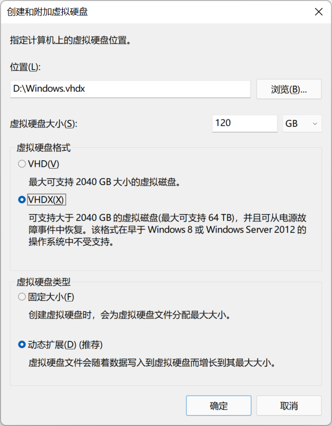
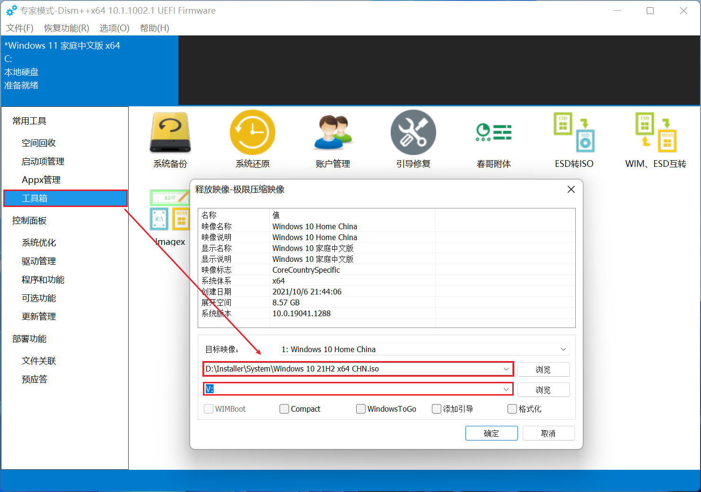
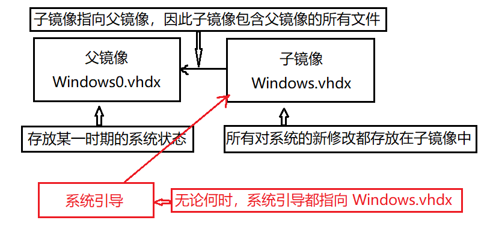

# 使用 VHDX 硬盘映像安装 Windows

创建于 2022/03/16；编辑于 2024/04/15

---

虚拟机无法调用显卡、而且部分软件对虚拟机有检测；单纯的双系统无法方便备份，而且专门分区总觉得浪费，而使用 VHDX 硬盘映像安装 Windows 可以解决这些问题。

## 在 VHDX 中安装系统

### 创建虚拟磁盘

打开磁盘管理 → 操作 → 创建 VHD，选择位置、大小、格式选择 VHDX，虚拟磁盘类型为「动态扩展」，完成创建。

创建完成后在磁盘管理中就可以看到新创建的虚拟磁盘，记住其为 `磁盘 n` 随后关闭磁盘管理即可。

> 后续都将默认虚拟磁盘位置为 `D:\Windows.vhdx`.

### 初始化虚拟磁盘

以管理员权限启动 Windows Powershell，执行 `diskpart` 进入 DiskPart 磁盘管理工具。

执行 `list disk`，查看 `磁盘 n` 是否为刚创建的虚拟磁盘（可通过大小判断）；  
`select disk n` 选择刚创建的虚拟磁盘；  
`create partition primary` 为虚拟磁盘创建主分区；  
`format quick` 格式化刚创建的分区；  
`assign letter=V` 为刚才的分区分配盘符 V（可以换成其他的）。

### 安装操作系统

使用 Dism++ 还原系统的功能，选择一个镜像，安装位置选择刚才为虚拟磁盘分出的 V 盘，不要勾选添加引导、格式化等选项，直接确定即可。

安装完后，可以在 Dism++ 中安装驱动，或者进行一些优化，当然这就是 Dism++ 的功能了，在此不赘述。

### 添加引导 (GPT + UEFI)

如果你将 VHDX 放在了没有引导分区的磁盘内（比如只有一个分区的移动硬盘），需要先创建一个 efi 分区，参考一些装系统的教程即可。

拥有 efi 引导分区后，可以用一些分区工具或 diskpart 为 efi 引导分区分配一个盘符，比如 S，S 指 System，系统分区。

以管理员身份运行 PowerShell，执行：  
`cd V:\Windows\System32` 跳转到虚拟磁盘内系统的 System32 文件夹；
`bcdboot V:\Windows /s S: /f UEFI`  
即可成功添加 UEFI 的引导。

如果使用 BIOS 方式，需要参考 BIOS 方式安装系统的分区，参考 [这里](https://docs.microsoft.com/zh-cn/windows-hardware/manufacture/desktop/boot-to-vhd--native-boot--add-a-virtual-hard-disk-to-the-boot-menu?view=windows-11#step-4-add-a-boot-entry)。

现在，重启电脑进入启动项选择界面，应该就能看到新安装的系统了：

> 装在当前系统之外硬盘，可能会在 BIOS 中多一个启动磁盘；装在一个硬盘中，效果未知（我的电脑主硬盘有 BitLocker 无法测试）。

## 实现备份和还原

先来理解一个概念，在安装系统创建引导的时候，引导永远指向 `D:\Windows.vhdx`，无论这个文件如何被替换，系统都会尝试引导这个文件。

我们先把 `D:\Windows.vhdx` 重命名为 `D:\Windows0.vhdx`，接着以管理员身份启动 PowerShell ：

执行 `create vdisk file="D:\Windows.vhdx" parent="D:\Windows0.vhdx"` 创建名为 `D:\Windows.vhdx` 的差分镜像。

现在：

1. Windows.vhdx 指向 Windows0.vhdx，包含 Windows0.vhdx 中的所有文件。
1. Windows0.vhdx 的文件已经被永久固定，日后所有对文件的修改（包括删除）都仅仅是对 Windows.vhdx 的修改。

这就意味着，我们可以随时通过：

1. 删除 Windows.vhdx.
1. 将 Windows0.vhdx 重命名为 Windows.vhdx.

来恢复系统到 Windows.vhdx 的状态，从而实现了瞬间备份。

有一张图方便理解：

> 一旦一个镜像有其子镜像（如上的 Windows0.vhdx 拥有子镜像 Windows.vhdx），这个父镜像不应以任何形式修改，**双击打开也叫做修改**，一旦父镜像修改，依附于其的子镜像**都会失效**。
> 
> 我们可以通过给父镜像设置只读属性来防止意外修改，但在需要修改时（比如合并子镜像和父镜像）记得撤销只读权限。

使用熟练后，可以：

* 创建多个连续的子镜像，实现多个「还原点」。
* 创建多个并列的子镜像，实现单系统的不同状态（通俗来讲，可以给不同的差分子镜像安装不同的软件）。

## 一些实用信息

* 如果对一个差分子镜像的修改满意，可以将其合并到父镜像，参考 [这里](https://docs.microsoft.com/zh-cn/windows-server/administration/windows-commands/merge-vdisk)（记得取消父镜像只读）。合并后子镜像仍存在但无法打开，可以手动删除。
* 虚拟系统会自动扩展磁盘空间到最大，可以参考 [这里](http://liray.github.io/2013/04/18/prevent-the-vhd-from-expanding-to-its-full-size/) 解决，重启即可生效。
