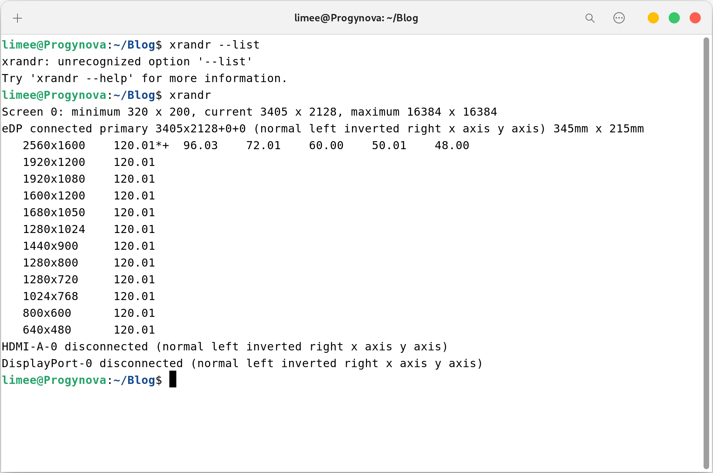
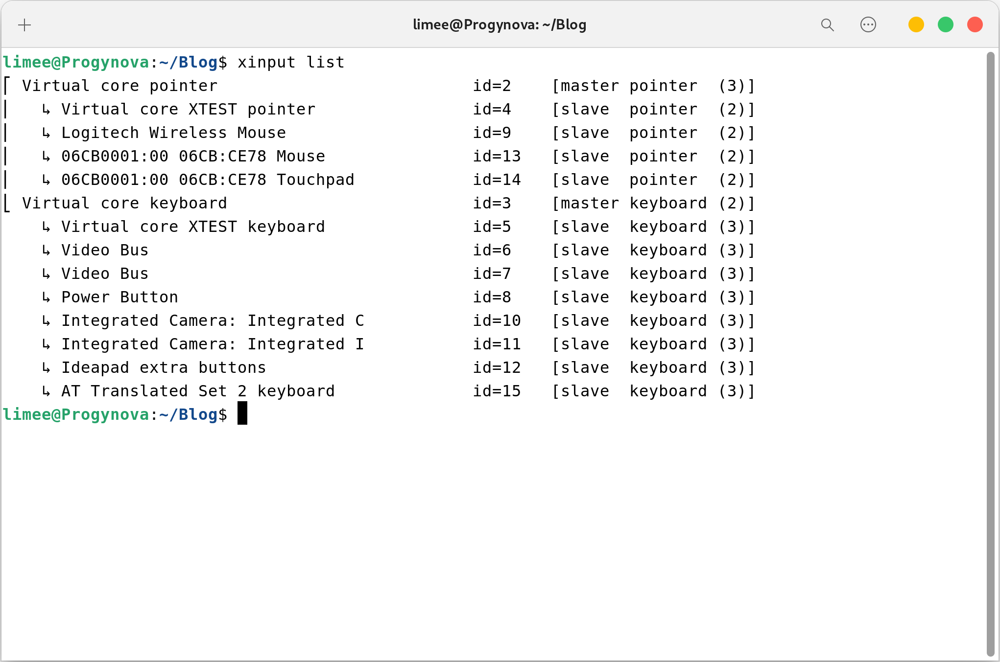
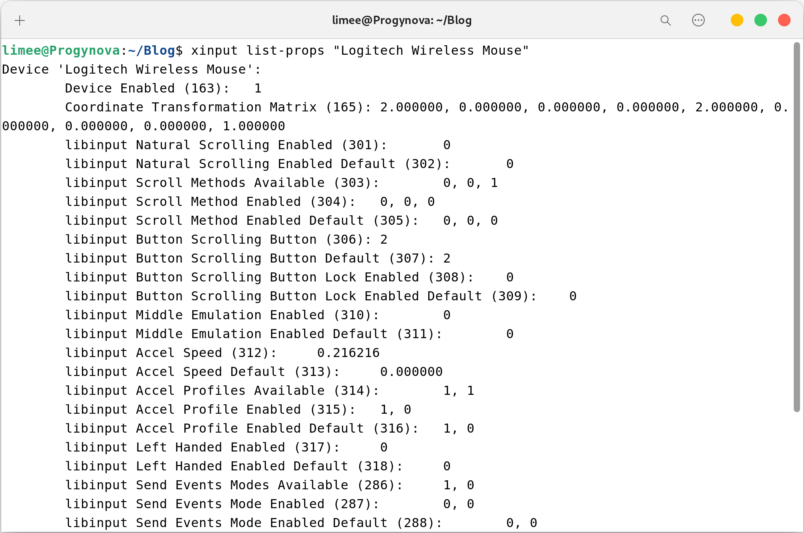

# Xorg 分数缩放的相关问题

创建于 2022/08/04；编辑于 2025/02/21

---

注：本文基于 X11 的 Gnome

## 启用分数缩放

首先进入 Gnome 的设置，将整数缩放调整为看起来偏大的值，比如 200%。

执行 `xrandr` 查看当前显示器，大概可以通过分辨率和刷新率判断，如图所示显示器的名称为 eDP.



现在启用 xrandr 的 「虚拟分辨率」功能：`xrandr --output eDP --scale 1.33x1.33`，将 eDP 替换为上一步获取到的显示器名称，1.33x1.33（中间是英文字母 x）为分辨率的缩放比例。

缩放比例可以这样计算：

需要缩放比例为 150%，整数缩放比例为 200%，那么分辨率需要缩放 200% / 150% = 1.33

现在缩放看起来就比较正常了。

## 开机自动应用分数缩放

执行 `gsettings set org.gnome.desktop.interface scaling-factor 2`（2 为上 N 步选择的整数缩放比例），将整数缩放比例固化。

创建文件 `~/.config/autostart/hidpi.sh`，内容如下（应该知道 1.33 是什么）：

```shell
#!/bin/bash
xrandr --output eDP-1 --scale 1.33x1.33
```

为其添加可执行权限：`sudo chmod +x ~/.config/autostart/hidpi.sh`

---

现在为其配置开机启动

创建文件 `~/.config/autostart/hidpi.desktop`，内容如下（username 替换成你的用户名）：
```
[Desktop Entry]
Name=HiDPI-Configuration
GenericName=HiDPI-Configuration
Comment=Configure HiDPI Fractional Scaling
Exec=/home/username/.config/autostart/hidpi.sh
Terminal=false
Type=Application
X-GNOME-Autostart-enabled=true
```

然后将这个文件复制到：

`sudo cp ~/.config/autostart/hidpi.desktop /usr/share/gdm/greeter/autostart/hidpi.desktop`  
`sudo cp ~/.config/autostart/hidpi.desktop /etc/xdg/autostart/hidpi.desktop`

现在重新启动系统，缩放比例应该可以自动设置了。

## 鼠标过慢？

如果你的鼠标 DPI 不高，那在使用虚拟分辨率后，即使调整设置中的鼠标速度，还是会感觉很慢或者有一种奇怪的感觉。

执行 `xinput list` 查看当前的输入设备列表，如图所示 Logitech Wireless Mouse（罗技无线鼠标）就是我们需要的（请自行判断自己的设备名）



执行 `xinput list-props "Logitech Wireless Mouse"`（自行替换设备名），查看此设备可调整的属性。



属性中可见 Coordinate Transformation Matrix 即坐标变换矩阵，调整它即可调整鼠标真正的速度，而不是加速度。

可以接受的值为 9 个小数，默认值应为 `1 0 0 0 1 0 0 0 1`，在此不研究它的原理，只需要知道第 1 和 5 个数，就是前两个 1 控制了鼠标移动的坐标变换。

只需要将前两个 1 调大，鼠标移动速度就可以变快，故 `xinput set-prop "Logitech Wireless Mouse" "Coordinate Transformation Matrix" 2 0 0 0 2 0 0 0 1`（仍然是自己替换掉设备名）将 1 改为 2，鼠标速度得以恢复正常。

---

没错这个重启会失效。

拿出上 N 步那个 `~/.config/autostart/hidpi.sh`，把最终的 `xinput set-prop "Logitech Wireless Mouse" "Coordinate Transformation Matrix" 2 0 0 0 2 0 0 0 1` 复制进去就可以了。

## 总结

又是一篇水文，但找到这些方法还是要花一段时间的，记录一下也无妨。

正是因为倔强的不使用「处处都是粗糙的边缘」的 KDE，Gnome wayland 下分数缩放的模糊，才引发了这一堆破事，~~如果没有强迫症该有多好。~~

有能力还是买台 200% 缩放的显示器或者笔记本，bug 少，不折腾，还清楚，对眼睛也好；没见过的话一定要去看看，我第一次见同学的着实被惊艳到了，后来就换掉了 150% 缩放的~~独显全都不能重薄本~~，买了个 200% 缩放的轻薄本……

---
参考

[Fixing HiDPI fractional scaling on Gnome + Xorg tearing and graphical glitches.](https://www.reddit.com/r/Fedora/comments/mlejm5/fixing_hidpi_fractional_scaling_on_gnome_xorg/)  
[How can I set mouse sensitivity, not just mouse acceleration?](https://unix.stackexchange.com/questions/90572/how-can-i-set-mouse-sensitivity-not-just-mouse-acceleration)
