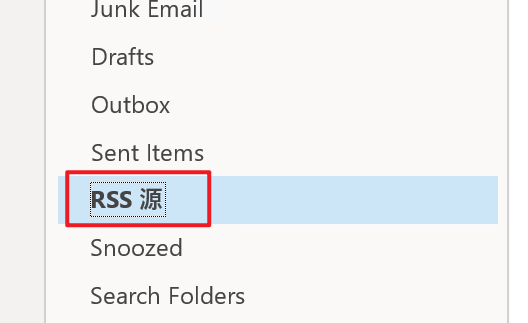
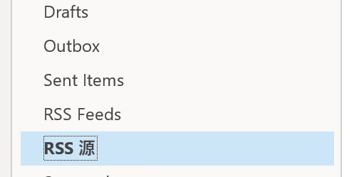

# 修正 Outlook 邮箱中「RSS 源」文件夹的语言

创建于 2024/06/29；编辑于 2024/06/29

---

如果之前使用中文操作系统，切换成英文系统后，在 Outlook 邮箱内可能会有一个顽固的「RSS 源」文件夹，别的都是英文只有它是中文，看起来十分碍眼。

## 准备材料

- Outlook 软件（Win32 版 Office 套件的一部分），需要是想更改的语言的版本。

## 操作步骤

在 Win32 版 Outlook 中登录账户，可见格格不入的「RSS 源」文件夹



关闭 Outlook，在命令行中带如下参数执行 Outlook 程序（找到文件所在位置，打开 Powershell，方法不再赘述）：

```powershell
.\outlook.exe /resetfolders # 执行后 Outlook 会自动打开，关闭它再执行下一条
.\outlook.exe /resetfoldernames
```

Outlook 自动启动后等待一小会，就可以发现有「RSS 源」和「RSS Feeds」两个文件夹了



此时原有的「RSS 源」文件夹即可重命名或删除。

## 注

- 删除后需要多等一段时间让各设备客户端同步。

- 如果删除之后在其他客户端仍能见到此文件夹，但 Win32 版 Outlook 软件中已经没有了，可以在 `C:\Users\%USERNAME%\AppData\Local\Microsoft\Outlook` 中删除账户对应的 Outlook Data File，重新打开 Win32 版 Outlook，文件夹就会重新出现，再手动删除即可。

- 如果手动删除多次无效，也可以先移动到其他文件夹内，再删除。

---

参考

[Change Name of Outlook RSS Feeds Folder](https://answers.microsoft.com/en-us/outlook_com/forum/all/change-name-of-outlook-rss-feeds-folder/740a3bdd-c9ff-41a5-a2c1-5f4bcffe4569)
