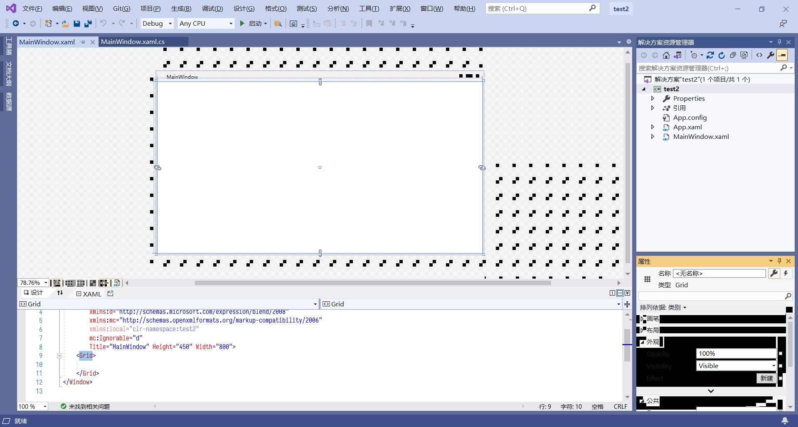
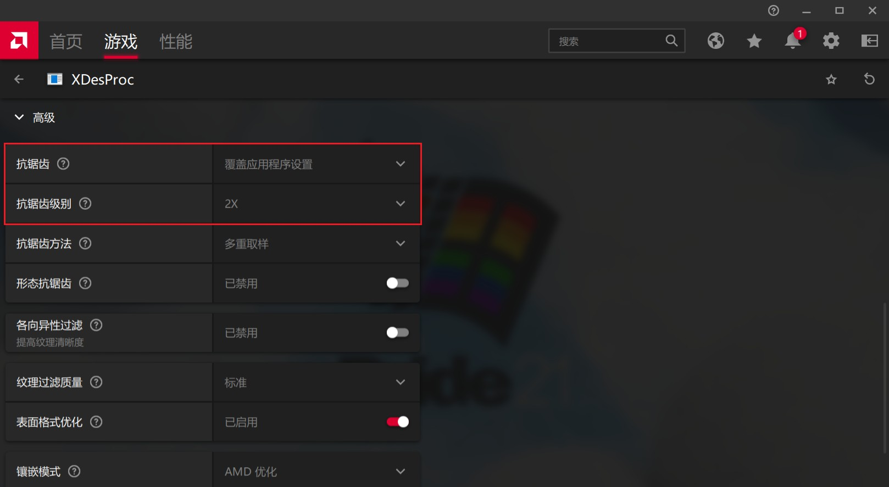

# AMD 集显运行 XAML 设计器花屏

创建于 2021/05/16；编辑于 2024/04/15

---

如果电脑使用的是 AMD 核心显卡，那么在使用 Visual Studio 2017/2019 编写基于 .NET Framework 的 WPF 应用程序时，可能会遇到 XAML 设计器花屏的问题：

## 解决方案

在「AMD Radeon Software」中，添加「Microsoft Visual Studio XAML Designer」（可在任务管理器中找到并定位）为游戏，并且调节「抗锯齿」为「覆盖应用程序设置」，抗锯齿级别为任意项即可（此处推荐2X）。

- 仍然出现的偶现花屏，只需将窗口向下还原，再最大化即可，大多数情况下不影响使用。

- 如果抗锯齿级别为 2X 不生效，可以调整为 2X EQ，测试正常后再重新调为 2X.
