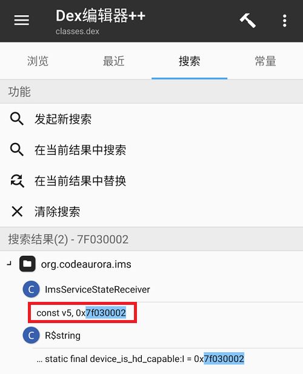

# 删除「SIM n 支持高清」通知

创建于 2021/05/17；编辑于 2024/04/15

---

部分原生系统在编译时，未考虑到会出现高清通知的问题，就没有在源码部分进行修改（比如 [这里](https://github.com/LiMeea/device_xiaomi_sm8250-common/commit/4a3c21d2c017a2806348ae1df3f96536b07500c0)）。因此在手机插入 SIM 卡，且启用 Volte 功能（此功能默认开启）后，会在通知栏显示一条或多条（如果你插了很多 SIM 卡）「SIM n 支持高清」的通知，这条通知无法被用户彻底隐藏。


## 解决方案

如果作为用户，已经无法对系统编译前的 Device Tree 进行修改了，所以只能修改编译好的应用程序，这里从通知的产生者——ims.apk 入手。

> **进行任何操作前，请注意对重要数据进行备份！**

### 提取产生通知的应用

使用可获取 Root 权限的文件管理器，将 `/system/product/priv-app/ims/ims.apk` 复制到用户目录内（如 `/data/media/0`）。

### 修改应用

1. 使用「MT 管理器」打开复制的 `ims.apk`，依次进入：查看 → resources.arsc → Arsc编辑器 → org.codeaurora.ims → string → string-zh-rCN.
在其中找到类似于「SIM %s 支持高清」的项目，长按并复制 ID.
1. 返回到「查看」页面，依次进入：classes.dex → Dex 编辑器 ++ → 搜索 → 发起新搜索；在查找内容里粘贴刚才复制的「ID」并进行搜索，随后点击 `const v5, 0xID`.



> 不同设备的 ID 可能不同

1. 进入代码编辑界面后从所在行向上翻找，直到发现 `.method private showHDIcon(Z)V` 为止。
1. 向下逐行查阅代码，去寻找如下结构，并将遇到的第一个如下结构删除（注意删除的时候需要将整行删除，不要只删掉文字，也不要删多了空行。）。
```smali
if-ne xxxx
return-void
```


修改完成后保存所做的一切修改，直到获取修改完的应用程序安装包，不需要重新签名。

## 替换还原

### 方法一：直接替换

直接将修改完的应用移回 `/system/product/priv-app/ims/ims.apk`，需要注意保持文件权限不变。

这样做可以让系统尽量**保持一个完整的状态而不分散**，个人感觉有利于系统稳定性。

### 方法二：制作模块

不推荐使用这种方法，因为制作模块的目的就是为了避免系统升级后反复修改，但谁能保证升级后的系统没有对模块内文件做修改呢？这可能导致一些莫名其妙的问题。

制作Magisk模块进行替换（此文不阐述，可以拆一个 Magisk 替换应用的模块照抄）。
