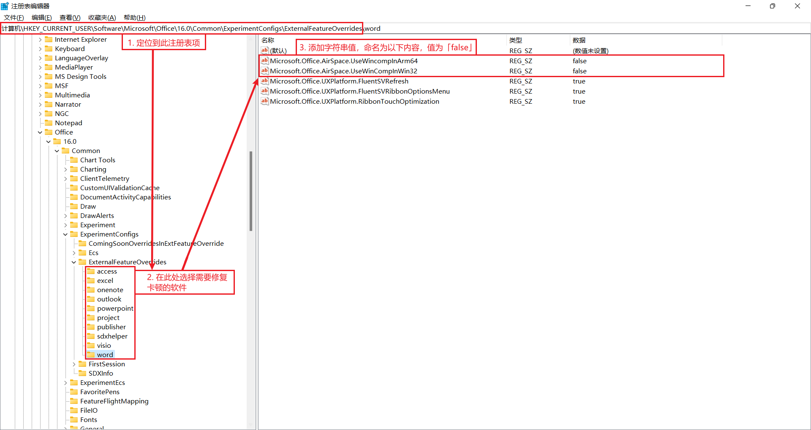

# 解决 Office 滚动卡顿

创建于 2021/07/15；编辑于 2025/02/21

---

从 2020 年末的某次 Office 更新之后，滚动 Word 中的文档（或者用触摸板的缩放手势缩放文档）会发生明显的卡顿，此现象在 PowerPoint 等软件中也可能存在。

## 解决方案

1. 定位到注册表项：`HKEY_CURRENT_USER\SOFTWARE\Microsoft\Office\16.0\Common\ExperimentConfigs\ExternalFeatureOverrides`.
1. 选择需要修复卡顿的软件。
1. 新建字符串值，名称分别为：`Microsoft.Office.AirSpace.UseWincompInArm64` 和 `Microsoft.Office.AirSpace.UseWinCompInWin32`，值均为 `false`.

---

> 在 Office 365 升级新外观后，此操作会导致 Office 应用的 Mica 效果、工具栏下方阴影缺失等问题。
