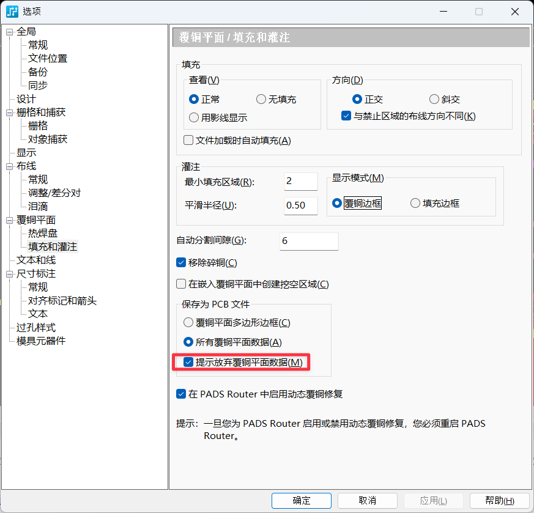

# PADs 的离谱 bug

创建于 2025/11/25；编辑于 2025/12/06

---

## 导出 BOM 发现中文乱码

只要在导出的时候保持中文输入法开启就行了，不知道和输入法有啥关系。

## 从 Layout 到 Router，Router 卡 88% 加载无法打开，直接消失

可能是因为在 Layout 中验证设计有错误导致的，在验证设计中把所有错误都删除就可以了。

## 我的丝印去哪了？

如果在 PCB 封装编辑器中在 SST 层添加了封装，更新到 PCB 后可能发现丝印并不存在。

这时只要执行 `z sst` 单独查看一下 SST 层，再返回之前查看的层，就能发现丝印神奇的出现了。

## 我的铺铜数据去哪了？

如果发现每次保存文件，PCB 覆铜数据都不能保存，重新打开后只能灌铜，那么：

需要在文件-选项-保存为 PCB 文件中选择「提示放弃覆铜平面数据」，再手动Ctrl+S 保存一下，在对话框中选择全部保存，即可保存覆铜数据了。

需要注意的是，**千万不要在那个对话框中选择「以后不要提醒我」**，因为它根本不会记你点的是哪个，只会默认给你不保存。

