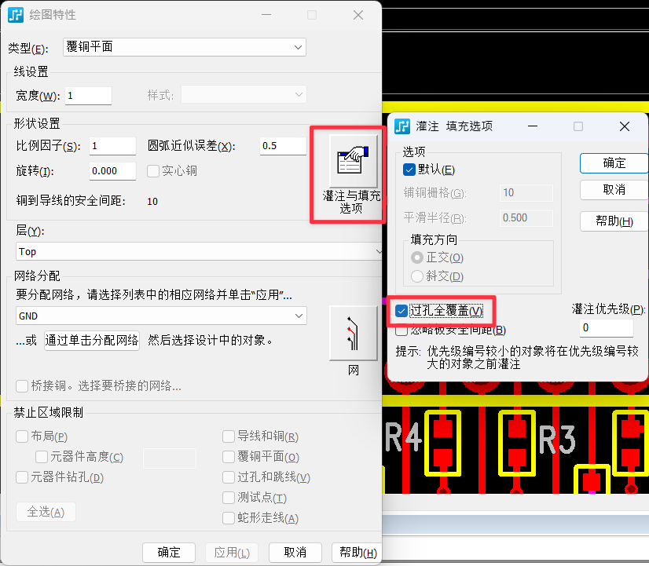
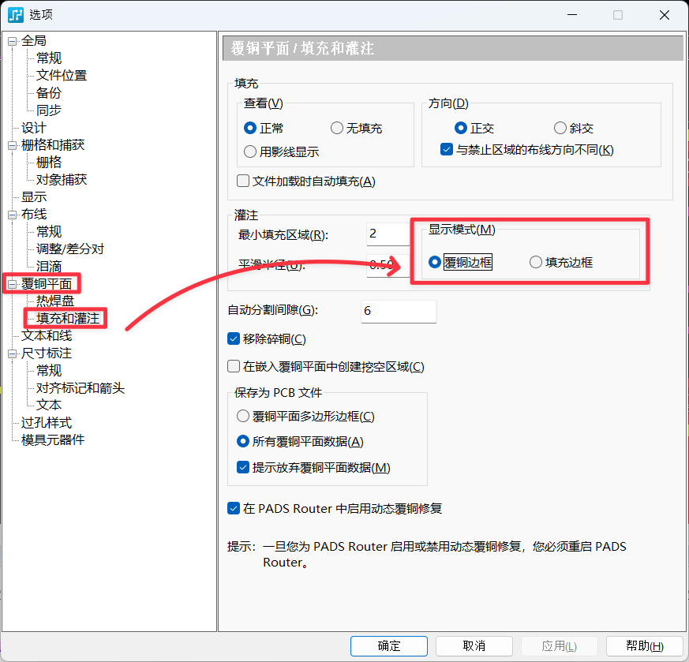
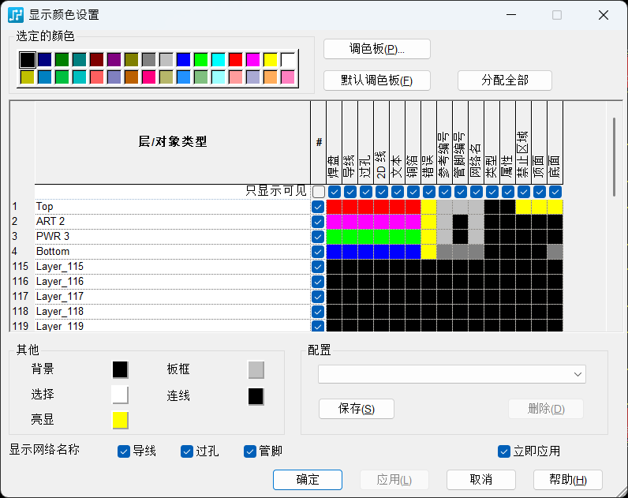
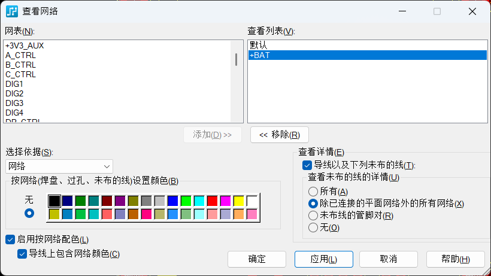

# PADs 技巧

创建于 2025/11/25；编辑于 2025/12/06

---

## 缝合孔斜交与铺铜平面连接，电流承载能力小

需要设置过孔全覆盖

右键选择形状，选择覆铜平面边框，打开绘图特性窗口：

点击右侧的填充与灌注选项，之后选择过孔全覆盖，再重新灌铜即可。

如果「填充与灌注选项」点不动，说明你选中的是覆铜平面，而不是覆铜平面边框（见下一条）。

## 为什么选中覆铜平面不能设置选项，如何选中覆铜平面边框？

覆铜平面就是已经灌注好的铜箔，是不能设置选项的，需要选中覆铜平面边框进行设置

在软件顶部菜单栏-工具-选项，打开软件的选项窗口，按下图所示选择灌注的显示模式为覆铜边框即可选择。

## 为什么画的东西消失了

如果发现画刚画好的东西，直接就消失不见了，大概是因为在「显示颜色」和「网络」设置中，将相应的东西给设置成了黑色（即隐藏状态）

就是下面两张图片所示的设置，可以自行检查一下：

